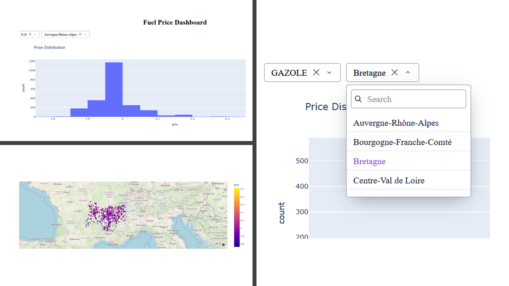

# Fuel Price Dashboard France

Interactive dashboard showing fuel prices in France using open data from [data.gouv.fr](https://www.data.gouv.fr/datasets/prix-des-carburants-en-france-flux-quotidien-1).

This project builds a complete **data pipeline** (download → clean → analyze) and an interactive web application using **Dash**.

## Overview

This project is an end-to-end data application that explores fuel prices in France using open data from [data.gouv.fr](https://www.data.gouv.fr/datasets/prix-des-carburants-en-france-flux-quotidien-1). It combines a complete data pipeline with an interactive dashboard to transform raw public data into insights.

The application **automatically retrieves** daily fuel price data, cleans and processes it, and presents it through dynamic visualizations built with Dash. The goal is to provide a way to explore fuel price variations across regions and fuel types.

## Features

1. Automated Data Pipeline
    * Download fuel price data from [data.gouv.fr](https://www.data.gouv.fr/)
    * Clean and preprocess raw datasets
    * Generate a structured dataset ready for analysis

2. Data Cleaning & Transformation
    * Handle missing and inconsistent values
    * Convert prices and dates into usable formats
    * Extract geographic coordinates for mapping

3. Exploratory Data Analysis
    * Price distribution analysis
    * Average price per fuel type
    * Regional and departmental comparisons
    * Geographic insights via maps

4. Interactive Dashboard
    * Dynamic filtering (fuel type, region, etc.)
    * Interactive charts and maps
    * Real-time updates using Dash callbacks

5. Clean Project Architecture
    * Modular structure (data, services, dashboard, utils)
    * Environment configuration using python-dotenv
    * Reusable and scalable components

6. Reproducible Workflow
    * End-to-end pipeline from raw data to visualization
    * Easy to run locally with minimal setup

## Technologies Used

* Python 3.13.1
* Pandas 3.0.1
* Requests 2.32.5
* Dash 4.0.0
* Plotly 6.6.0
* Python-dotenv 1.2.2
* Jupyter 1.1.1

## Installation and Usage

```bash
git clone https://github.com/CMagnac/Fuel-Prices-Python-Dashboard.git
cd Fuel-Prices-Python-Dashboard
python -m venv env
source env/bin/activate  # Mac/Linux
env\Scripts\activate     # Windows
pip install -r requirements.txt
pip install -e .
python src/dashboard/app.py
```

## Demo


